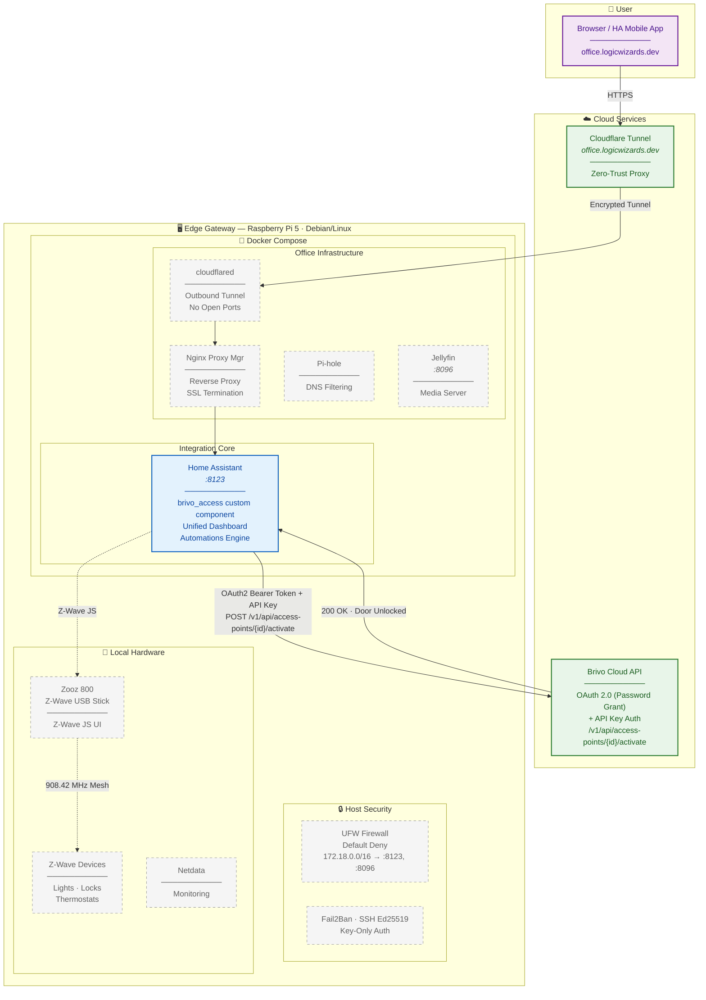

# Brivo Access for Home Assistant

A custom Home Assistant integration that enables **Administrator-level remote unlocks** for Brivo Access doors — powered natively by Home Assistant's `aiohttp` with zero latency and no digital credential required.

## Features

- **Administrator Bypass**: Utilizes the hidden `/activate` endpoint to perform native momentary door strikes.
- **Lightning Fast**: Powered natively by Home Assistant's `aiohttp` over your host network.
- **Local Network**: No third-party intermediaries.
- **Auto Token Refresh**: Handles OAuth2 token expiration gracefully — automatically refreshes and retries on `401` responses.

---

## Architecture

### How This Integration Fits

This integration is one component in a broader **edge gateway ecosystem** (codenamed "WizardBase") running at the LogicWizards office. The diagram below shows the full system architecture — the `brivo_access` custom component runs **inside** the Home Assistant container, while the surrounding infrastructure provides secure remote access, DNS filtering, monitoring, and local device control.

> **Reading the diagram:** Components with a solid border are **direct actors** in the Brivo integration flow. Components with a dashed border are part of the broader office ecosystem — they run on the same hardware but are not involved in the Brivo unlock flow.



### Component Legend

| Component | Role in Brivo Integration | Notes |
|---|---|---|
| **Home Assistant** | ✅ **Core** — runs the `brivo_access` custom component | Handles OAuth2 auth, token refresh, and the `/activate` API call |
| **Brivo Cloud API** | ✅ **Core** — the target API | OAuth2 password grant + API key authentication |
| **cloudflared** | 🔗 Infrastructure — secure remote access | Cloudflare Tunnel provides Zero-Trust access to HA without opening ports |
| **Nginx Proxy Manager** | 🔗 Infrastructure — reverse proxy | Routes `office.logicwizards.dev` to the correct container |
| **Pi-hole** | 🏠 Ecosystem — DNS filtering | Network-wide ad/tracker blocking; not involved in the Brivo flow |
| **Jellyfin** | 🏠 Ecosystem — media server | Separate home service on the same hardware |
| **Z-Wave JS / Zooz 800** | 🏠 Ecosystem — local device mesh | Controls lights, thermostats, locks via 908.42 MHz; separate protocol from Brivo |
| **UFW / Fail2Ban / SSH** | 🔗 Infrastructure — host security | Default-deny firewall, intrusion prevention, key-only SSH |
| **Netdata** | 🏠 Ecosystem — monitoring | Real-time CPU/RAM/network I/O dashboards for the Pi |

### Unlock Flow

When a user taps "Unlock" in the Home Assistant dashboard:

```
User → office.logicwizards.dev
  ↓ HTTPS (Cloudflare proxy)
Cloudflare Edge → cloudflared (encrypted tunnel, 0 open ports)
  ↓ Docker internal network
Nginx Proxy Manager → Home Assistant (:8123)
  ↓ brivo_access service call
Home Assistant → Brivo Cloud API
  POST /v1/api/access-points/{door_id}/activate
  Headers: Authorization: Bearer {token}, api-key: {key}
  ↓ 200 OK
Home Assistant → User (door unlocked ✅)
```

If the token has expired, the integration automatically re-authenticates via the OAuth2 password grant and retries — no user intervention needed.

### Security Posture

The edge gateway achieves an **A+ security rating** with **zero publicly exposed ports**:

| Layer | Implementation |
|---|---|
| Remote Access | Cloudflare Tunnel (outbound-only, no port forwarding) |
| Firewall | UFW default-deny; surgical rules for Docker subnet `172.18.0.0/16` → `:8123`, `:8096` only |
| Authentication | SSH Ed25519 key-only (password auth disabled) |
| Intrusion Prevention | Fail2Ban monitoring SSH access logs |
| Durability | `log2ram` for SD card lifespan on Raspberry Pi |

---

## Installation

### HACS
1. Open HACS and add a Custom Repository: `https://github.com/thelogicwizards/brivo-home-assistant`.
2. Select **"Integration"** as the category.
3. Install the integration and restart Home Assistant.

### Configuration
Add your Brivo credentials to `configuration.yaml`:
```yaml
brivo_access:
  client_id: "YOUR_CLIENT_ID"
  client_secret: "YOUR_CLIENT_SECRET"
  api_key: "YOUR_API_KEY"
  username: "YOUR_BRIVO_ADMIN_USERNAME"
  password: "YOUR_BRIVO_ADMIN_PASSWORD"
```

> ⚠️ **Security note:** Store credentials using [Home Assistant Secrets](https://www.home-assistant.io/docs/configuration/secrets/) rather than hardcoding them in `configuration.yaml`.

## Usage
Once installed, a new service `brivo_access.unlock_door` will be available in Home Assistant.

Use it in template buttons or automations:
```yaml
template:
  - button:
      - name: "Unlock Door"
        icon: mdi:door-open
        press:
          - service: brivo_access.unlock_door
            data:
              door_id: "12345678"
```

## Project Structure
```
brivo-home-assistant/
├── custom_components/
│   └── brivo_access/
│       ├── __init__.py        # Core integration (OAuth2 auth, unlock service)
│       ├── manifest.json      # HA integration metadata
│       └── services.yaml      # Service definition for unlock_door
├── hacs.json                  # HACS custom repository config
└── README.md
```

## Status

> 🟢 **Live** — The live instance at `office.logicwizards.dev` is online and operational. The integration is functional and tested.

## License

MIT
